# Swift Package Manager Static Dynamic Xcode Bug

Since Xcode 11.4 and Swift 5.2 you may experience some trouble regarding SPM and compilation errors due to

* Library duplication

Create **SPMLibraries** is a possible workaround to continue using SPM with Xcode 11.4 and avoid moving all your external dependencies to `.dynamic` ones.

## Step by Step

Step 1 to 3 is only to create a new project from scratch to reproduce the problem.

You can jump directly to step 4 to get the workaround immeditely

### Step 1: project without libraries

* this commit contains placeholder for the main screen and the widget

### Step 2: add just the first external library (SwiftClockUI) with SPM for the main project

* I don't try to use the external library for the Widget yet
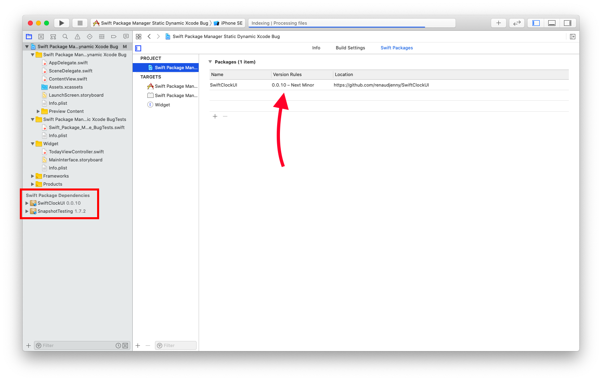
* You can notice that we have already a dependencies for SnapshotTesting, keep that in mind for later.

### Step 3: add the same external library for the Widget (❌ won't compile)

* Add the external library to the Widget
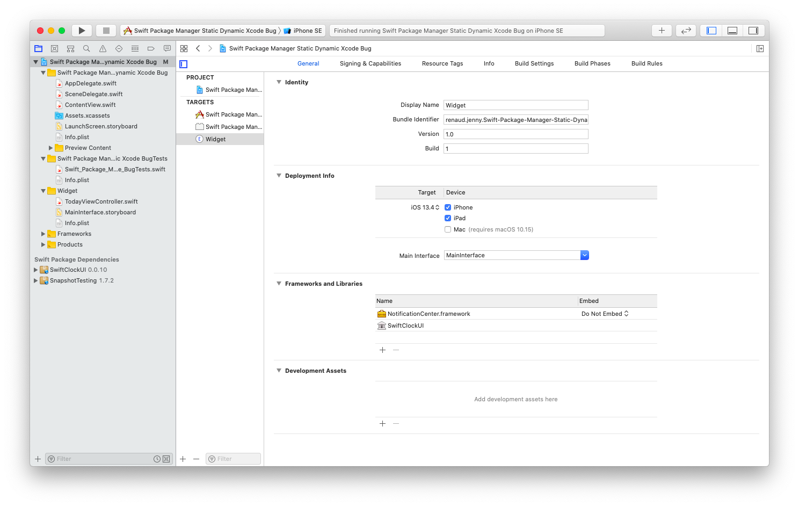

* Library duplication: Swift package product 'your library' is linked as a static library by 'your project' and 'your widget'. This will result in duplication of library code. 😞
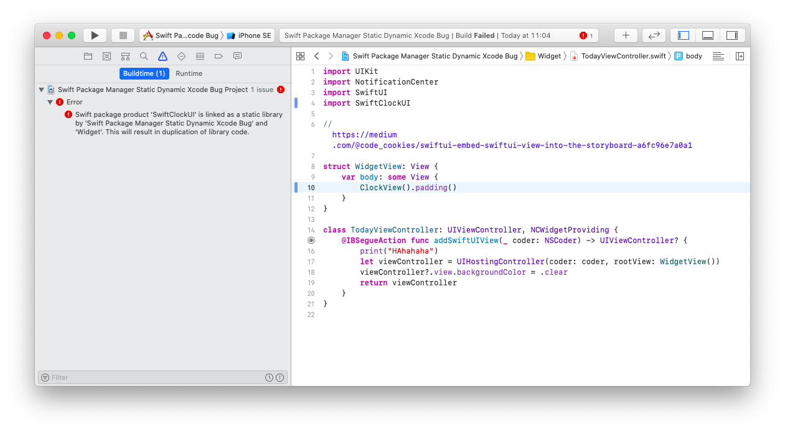

### Step 4: create an additional internal Framework named **SPMLibraries**

* Click on the + button to add a new Framework
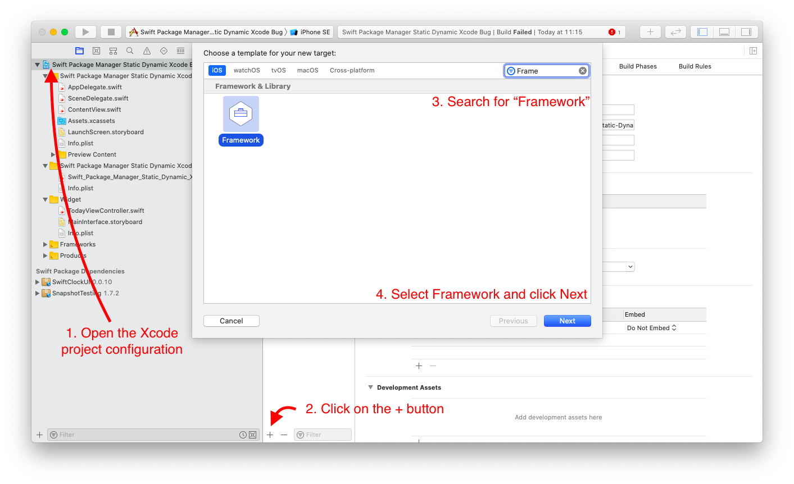

* Name it **SPMLibraries** or something like this (uncheck *Include Unit Tests*)
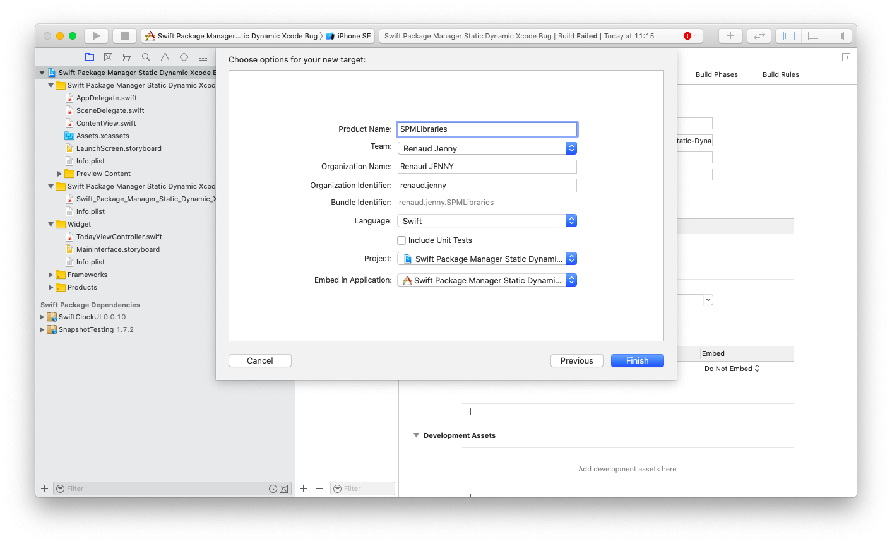

* Add all the static dependencies from SPM you need here by clicking on the + button
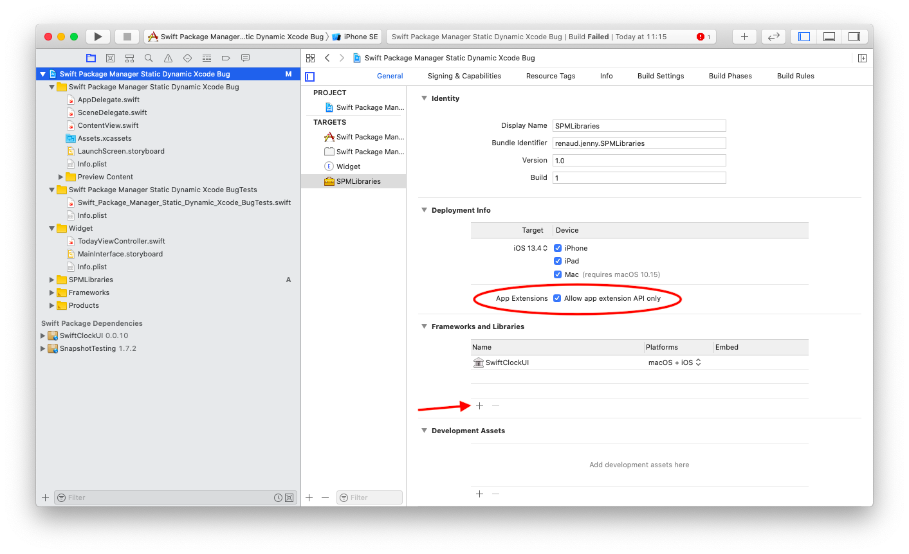
* ⚠️ Click on the "Allow app extension API only". It's important for Widget, instead it will be refused by the AppStore review

* In your project targets (your project and your widget), remove references to your external library (SwiftClockUI)
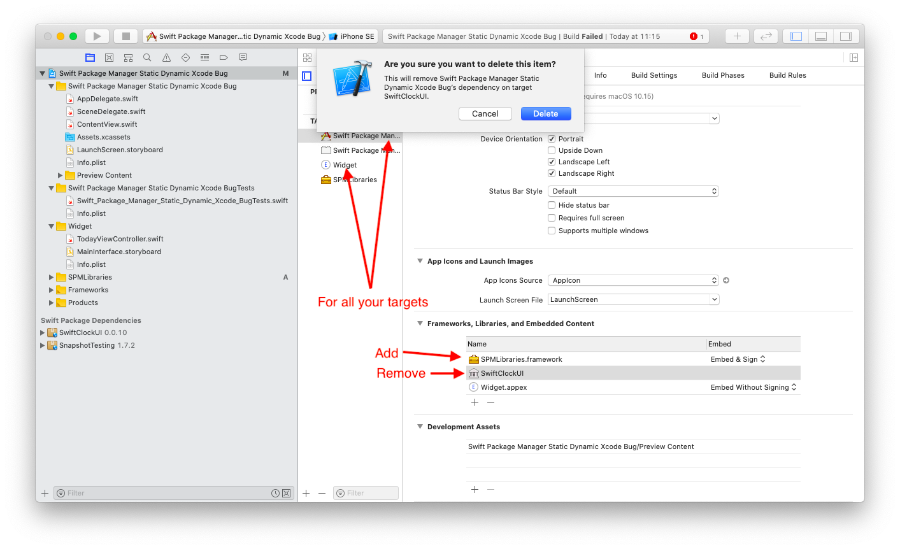
* Add **SPMLibraries** as a Framework
* Your project now compiles 🎉

### Step 5: add common libraries into Unit Tests target

If you're using the same library as one of your dependency already use, you will have a library conflict.

* My project use **SnapshotTesting library** from [Point-Free](https://github.com/pointfreeco/swift-snapshot-testing)
* One of my library use it as well... so I've already this dependency in my project, indirectly though
* My Unit Tests target is unable to access directly to **SnapshotTesting** 😞 with a "No such module 'SnapshotTesting'"
* Tests won't compile and run...

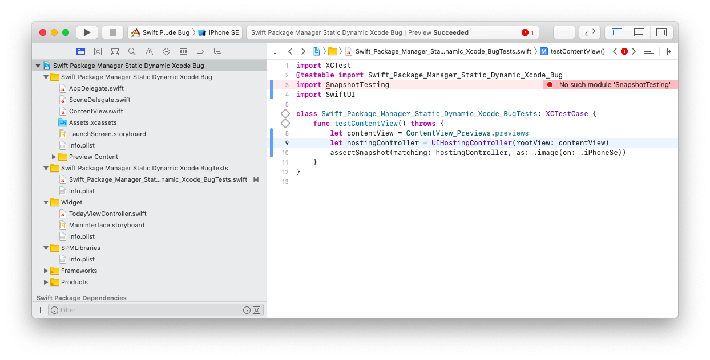

Here is the steps to follow to get the workaround

#### Step 1: Add your common dependency as a SPM package in your main project (even if it's indirectly already there)

* ❗️ For library like this one, you shouldn't link it with your project, so uncheck this while SPM/Xcode ask you which target you want
* ⚠️ don't forget to update to last package version!

#### Step 2: Link common libraries with your Unit Tests target manually

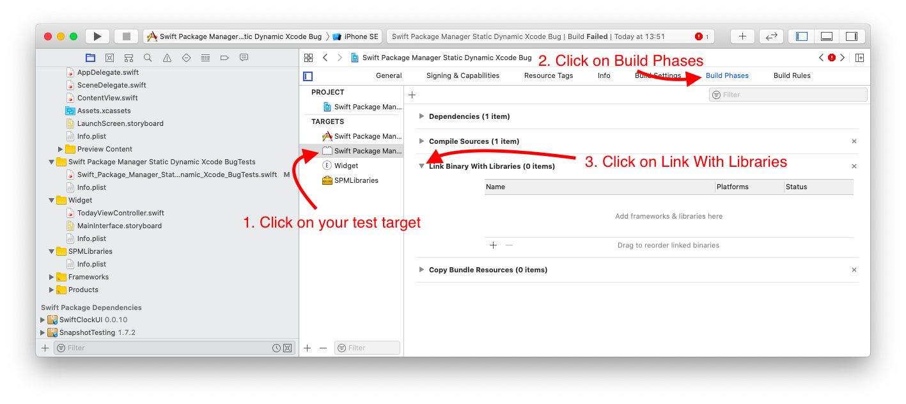

* You need to go to "Build Phases" and add libraries that Unit Tests will use manually

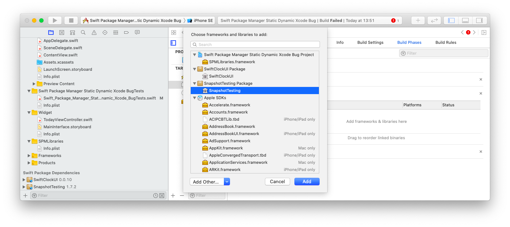

* Add SPMLibraries framework as well

* And here we are 🎉🎉🎉

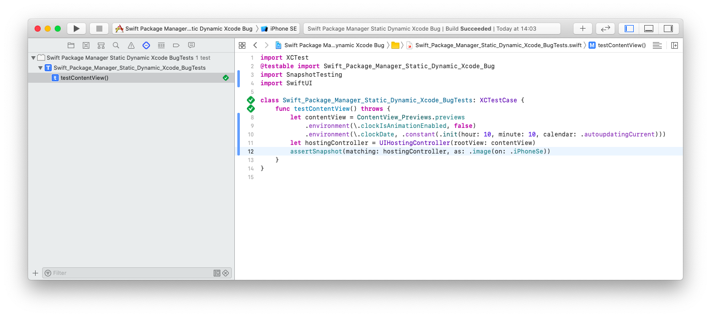
